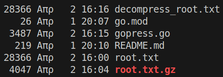

Go program that compress and decompress files.

```shell
git clone https://github.com/mariosdaskalas/gopress && cd gopress && go run .
```

To find the size of the files use the following command.

```shell
stat root.txt
stat root.txt.gz
stat decompress_root.txt
```

Here is an estimate of the reduction size using this program.




```shell
go version go1.24.1 linux/amd64
```